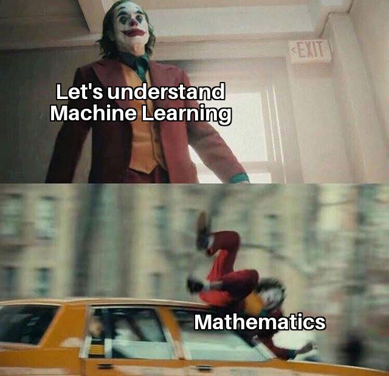
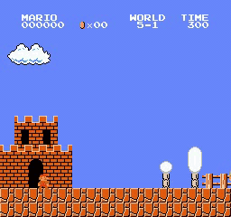

# NTUME Robot Lab - ML/DL Training
2022/07/23 released

Report : [pdf](20220723_training.pdf)

## Environment
* Python 3.8.13
* CUDA 11.3
* Pytorch 1.11

## Usage (run on local machine)
```shell
# 使用Anaconda建立名為training的虛擬環境
$ conda create --name training python=3.8.13

# 啟動名為training的虛擬環境
$ conda activate training

$ git clone https://github.com/Offliners/RobotLab-MLDL-Training-2022.git
$ cd RobotLab-MLDL-Training-2022

# 安裝此專案所需的所有函式庫
$ pip install -r requirements.txt

# 前往想要訓練的教程
$ cd tutorial-x

# 完成訓練後即可關閉虛擬環境
$ conda deactivate

# 若之後確定不會使用的話，可以移除虛擬環境
$ conda env remove -n training
```

## Tutorial 1 - Covid19 Cases Prediction
透過相關係數的分析，選出重要的特徵來訓練模型做Covid19 Cases Prediction


Dataset Resource : [Covid19 Cases](https://www.kaggle.com/competitions/ml2022spring-hw1/data)

Links : [[README](./tutorial-1/README.md)] [[Jupyter Notebook](./tutorial-1/colab/tutorial-1.ipynb)] [[Google Colab](https://colab.research.google.com/github/Offliners/RobotLab-MLDL-Training-2022/blob/main/tutorial-1/colab/tutorial-1.ipynb)]

## Tutorial 2 - Food Classification
透過Teacher-Student的架構，訓練出3個學生模型，並使用Ensemble與Test Time Augmentation的技術來完成Food Classification


Dataset Resource : [Food11](https://www.kaggle.com/competitions/ml2021spring-hw3/data)

Links : [[README](./tutorial-2/README.md)] [[Jupyter Notebook](./tutorial-2/colab/tutorial-2.ipynb)] [[Google Colab](https://colab.research.google.com/github/Offliners/RobotLab-MLDL-Training-2022/blob/main/tutorial-2/colab/tutorial-2.ipynb)]

## Tutorial 3 - Synthetic Image Segmentation
使用resnet18當backbone，並用UNet來完成Synthetic Image Segmentation


Links : [[README](./tutorial-3/README.md)] [[Jupyter Notebook]()] [[Google Colab]()]

## Tutorial 4 - Anime Face Generation
使用SNGAN來完成Anime Face Generation


Dataset Resource : [Crypko](https://crypko.ai/#)

Links : [[README](./tutorial-4/README.md)] [[Jupyter Notebook]()] [[Google Colab]()]

## Tutorial 5 - Super Mario
使用A3C來訓練模型完成Super Mario任務

|World/Stage|1|2|3|4|
|-|-|-|-|-|
|1||Unsolved<!---->|Unsolved<!---->||
|2|Unsolved<!---->|||Unsolved<!---->|
|3||Unsolved<!---->|Unsolved<!---->||
|4||Unsolved<!---->|Unsolved<!---->|Unsolved<!---->|
|5||Unsolved<!---->|Unsolved<!---->|Unsolved<!---->|
|6|Unsolved<!---->|Unsolved<!---->|Unsolved<!---->|Unsolved<!---->|
|7|Unsolved<!---->|Unsolved<!---->||Unsolved<!---->|
|8|Unsolved<!--)-->|||Unsolved<!---->|

Environment : [gym-super-mario-bros](https://github.com/Kautenja/gym-super-mario-bros)

Links : [[README](./tutorial-5/README.md)] [[Jupyter Notebook]()] [[Google Colab]()]

## References
* [Pytorch official tutorials](https://pytorch.org/tutorials/)
* [NTU Machine Learning 2021 Spring (EE5184, by Prof. Hung-yi Lee)](https://speech.ee.ntu.edu.tw/~hylee/ml/2021-spring.php)
* [NTU Machine Learning 2022 Spring (EE5184, by Prof. Hung-yi Lee)](https://speech.ee.ntu.edu.tw/~hylee/ml/2022-spring.php)
