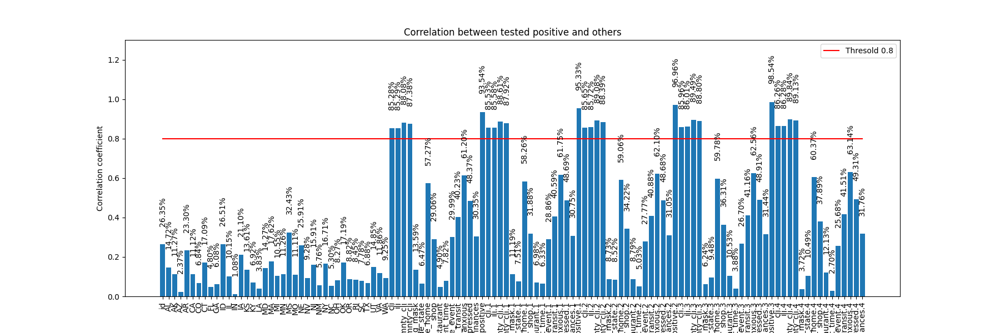

# NTUME Robot Lab - ML/DL Training
2022/07/23 released

Report : [pdf](20220723_training.pdf)

## Environment
* Python 3.8.13
* CUDA 11.3
* Pytorch 1.11

## Usage (run on local machine)
```shell
# 使用Anaconda建立名為training的虛擬環境
$ conda create --name training python=3.8.13

# 啟動名為training的虛擬環境
$ conda activate training

$ git clone https://github.com/Offliners/RobotLab-MLDL-Training-2022.git
$ cd RobotLab-MLDL-Training-2022

# 安裝此專案所需的所有函式庫
$ pip install -r requirements.txt

# 關閉虛擬環境
$ conda deactivate

# 若之後確定不會使用的話，可以移除虛擬環境
$ conda env remove -n training
```

## Tutorial 1 - Covid19 Cases Prediction


Dataset Resource : [Delphi group @ CMU](https://delphi.cmu.edu/covid19/ctis/)

Links : [[README](./tutorial-1/README.md)] [[Jupyter Notebook]()] [[Google Colab]()]

## Tutorial 2 - CIFAR 10

Links : [[README]()] [[Jupyter Notebook]()] [[Google Colab]()]

## Tutorial 3 - Walking Scene Segmentation

Links : [[README]()] [[Jupyter Notebook]()] [[Google Colab]()]

## Tutorial 4 - Anime Face Generation


Dataset Resource : [Crypko](https://crypko.ai/#)

Links : [[README](./tutorial-4/README.md)] [[Jupyter Notebook]()] [[Google Colab]()]

## Tutorial 5 - Lunar Lander

Links : [[README]()] [[Jupyter Notebook]()] [[Google Colab]()]

## Test Content (2022/07/23 released)

## References
* [Pytorch official tutorials](https://pytorch.org/tutorials/)
* [Pytorch lightning official tutorials](https://www.pytorchlightning.ai/tutorials)
* [MIT Deep Learning and Artificial Intelligence Lectures](https://deeplearning.mit.edu/)
* [UC Berkeley Deep Reinforcement Learning (CS285)](https://rail.eecs.berkeley.edu/deeprlcourse/)
* [NTU Machine Learning 2021 Spring (EE5184, by Prof. Hung-yi Lee)](https://speech.ee.ntu.edu.tw/~hylee/ml/2021-spring.php)
* [NTU Applied Deep Learning 2022 Spring (CSIE5431, by Prof. Yun-Nung Chen)](https://www.csie.ntu.edu.tw/~miulab/s110-adl/)