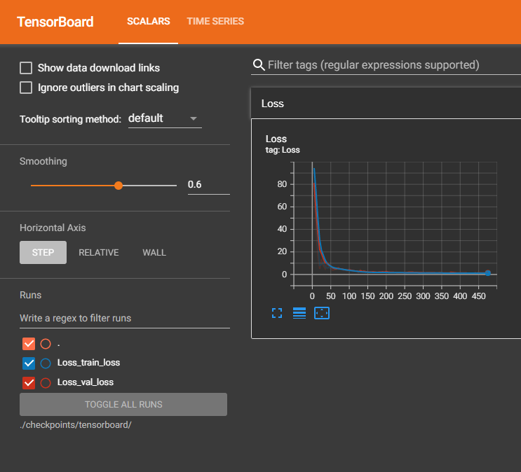

# Tutorial 1 - Covid19 Cases Prediction

## Feature Selection
特徵相關性矩陣


使用相關係數來選取重要特徵(Threshold : 0.8)


模型訓練完畢後，比較預測結果與實際結果是否相近


## Usage
在本機端開始訓練
```shell
$ cd python

# 下載訓練資料
$ python download_dataset.py

# 開始訓練
$ python main.py
```

使用Tensorboard來紀錄Loss變化
```shell
$ tensorboard --logdir=./checkpoints/tensorboard/
```



產生的資料夾內容
```shell
python/
    checkpoints/
        model/
            model.pth
        tensorboard/
            Loss_train_loss/
            Loss_val_loss/
    output/
        pred.csv
    data/
        test.csv
        train.csv
```

產生的`pred.csv`可上傳至[Kaggle](https://www.kaggle.com/competitions/ml2022spring-hw1)看表現如何

我的分數如下:

Public score : `0.85368` (Rank : `92/944`)

Private score : `0.89451` (Rank : `89/944`)

## Help
```shell
$ python main.py --help
usage: main.py [-h] [--seed SEED] [--epoch EPOCH] [--select_all SELECT_ALL] [--train_batchsize TRAIN_BATCHSIZE] [--val_batchsize VAL_BATCHSIZE] [--test_batchsize TEST_BATCHSIZE] [--split_ratio SPLIT_RATIO]
               [--correlation_threshold CORRELATION_THRESHOLD] [--optimizer OPTIMIZER] [--lr LR] [--lr_patience LR_PATIENCE] [--weight_decay WEIGHT_DECAY] [--train_path TRAIN_PATH] [--test_path TEST_PATH]
               [--early_stop EARLY_STOP] [--save_model_path SAVE_MODEL_PATH] [--save_csv_path SAVE_CSV_PATH] [--tensorboard TENSORBOARD]

Robotlab MLDL Training Tutorial 1 - Covid19 Cases Prediction

optional arguments:
  -h, --help            show this help message and exit
  --seed SEED           Set random seed
  --epoch EPOCH         Set training epochs
  --select_all SELECT_ALL
                        Whether to select all features
  --train_batchsize TRAIN_BATCHSIZE
                        Set training batchsize
  --val_batchsize VAL_BATCHSIZE
                        Set validation batchsize
  --test_batchsize TEST_BATCHSIZE
                        Set test batchsize
  --split_ratio SPLIT_RATIO
                        Set split ratio
  --correlation_threshold CORRELATION_THRESHOLD
                        Set correlation coefficient threshold
  --optimizer OPTIMIZER
                        Set optimizer
  --lr LR               Set learning rate
  --lr_patience LR_PATIENCE
                        Set patience of learning rate
  --weight_decay WEIGHT_DECAY
                        Set weight decay
  --train_path TRAIN_PATH
                        Path of training data
  --test_path TEST_PATH
                        Path of test data
  --early_stop EARLY_STOP
                        Set epoch of early stopping
  --save_model_path SAVE_MODEL_PATH
                        Path of best model
  --save_csv_path SAVE_CSV_PATH
                        Path of prediction csv
  --tensorboard TENSORBOARD
                        Path of tensorboard
```