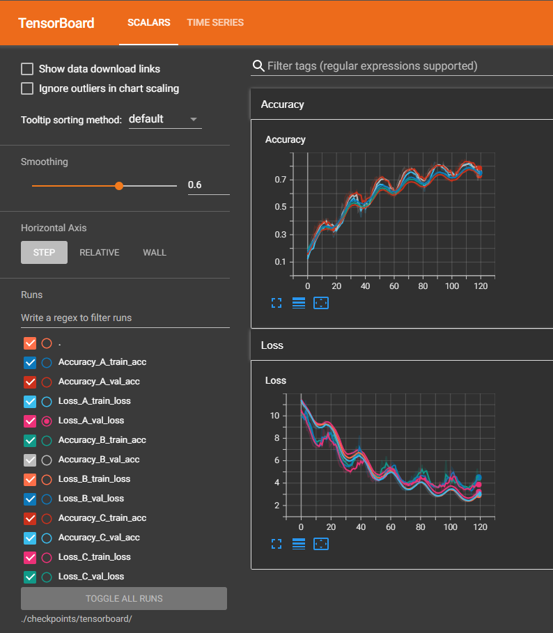

# Tutorial 2 - Food Classification

## Usage
在本機端開始訓練
```shell 
$ cd python

# 下載訓練資料
$ python download_dataset.py

# 開始訓練
$ python main.py
```

使用Tensorboard來觀看訓練與驗證的Accuracy與Loss
```shell
$ tensorboard --logdir=./checkpoints/tensorboard/
```


產生的資料夾內容
```shell
python/
    checkpoints/
        model/
            model_A.pth
            model_B.pth
            model_C.pth
        tensorboard/
            Accuracy_A_train_acc/
            Accuracy_A_val_acc/
            Loss_A_train_loss/
            Loss_A_val_loss/
            Accuracy_B_train_acc/
            Accuracy_B_val_acc/
            Loss_B_train_loss/
            Loss_B_val_loss/
            Accuracy_C_train_acc/
            Accuracy_C_val_acc/
            Loss_C_train_loss/
            Loss_C_val_loss/
    data/
        testing/
        training/
        validation/
        teacher_model.pth
```

產生的`pred.csv`可上傳至[Kaggle](https://www.kaggle.com/competitions/ml2021spring-hw3/)看表現如何

Kaggle分數
||Teacher (resnet18)|Student A (resnet50)|Student B (resnet50)|Student C (resnet50)|Students (Ensemble)|
|-|-|-|-|-|-|
|Public score|0.90023|||||
|Private score|0.89121|||||


## Help
```shell
$ python main.py --help
usage: main.py [-h] [--seed SEED] [--epoch EPOCH] [--pseudo_label_threshold PSEUDO_LABEL_THRESHOLD] [--num_worker NUM_WORKER] [--train_batchsize TRAIN_BATCHSIZE] [--val_batchsize VAL_BATCHSIZE]
               [--test_batchsize TEST_BATCHSIZE] [--optimizer OPTIMIZER] [--lr LR] [--weight_decay WEIGHT_DECAY] [--period PERIOD] [--use_tta USE_TTA] [--alpha ALPHA] [--train_dir TRAIN_DIR]
               [--unlabeled_dir UNLABELED_DIR] [--valid_dir VALID_DIR] [--test_dir TEST_DIR] [--teacher_model_path TEACHER_MODEL_PATH] [--student_A_name STUDENT_A_NAME] [--student_B_name STUDENT_B_NAME]
               [--student_C_name STUDENT_C_NAME] [--save_student_model_dir SAVE_STUDENT_MODEL_DIR] [--save_csv_dir SAVE_CSV_DIR] [--tensorboard TENSORBOARD]

Robotlab MLDL Training Tutorial 2 - Food Classification

optional arguments:
  -h, --help            show this help message and exit
  --seed SEED           Set random seed
  --epoch EPOCH         Set training epochs
  --pseudo_label_threshold PSEUDO_LABEL_THRESHOLD
                        Set threshold of pseudo labels
  --num_worker NUM_WORKER
                        Set number of worker
  --train_batchsize TRAIN_BATCHSIZE
                        Set training batchsize
  --val_batchsize VAL_BATCHSIZE
                        Set validation batchsize
  --test_batchsize TEST_BATCHSIZE
                        Set test batchsize
  --optimizer OPTIMIZER
                        Set optimizer
  --lr LR               Set learning rate
  --weight_decay WEIGHT_DECAY
                        Set weight decay
  --period PERIOD       Set maximum number of iterations
  --use_tta USE_TTA     Whether to do test time augmentation
  --alpha ALPHA         Set weight between test_tfm and train_tfm
  --train_dir TRAIN_DIR
                        Path of labeled training data directory
  --unlabeled_dir UNLABELED_DIR
                        Path of unlabeled training data directory
  --valid_dir VALID_DIR
                        Path of validation data directory
  --test_dir TEST_DIR   Path of test data directory
  --teacher_model_path TEACHER_MODEL_PATH
                        Path of teacher model
  --student_A_name STUDENT_A_NAME
                        Name of student A model
  --student_B_name STUDENT_B_NAME
                        Name of student B model
  --student_C_name STUDENT_C_NAME
                        Name of student C model
  --save_student_model_dir SAVE_STUDENT_MODEL_DIR
                        Path of saved student model directory
  --save_csv_dir SAVE_CSV_DIR
                        Path of prediction csv directory
  --tensorboard TENSORBOARD
                        Path of tensorboard
```