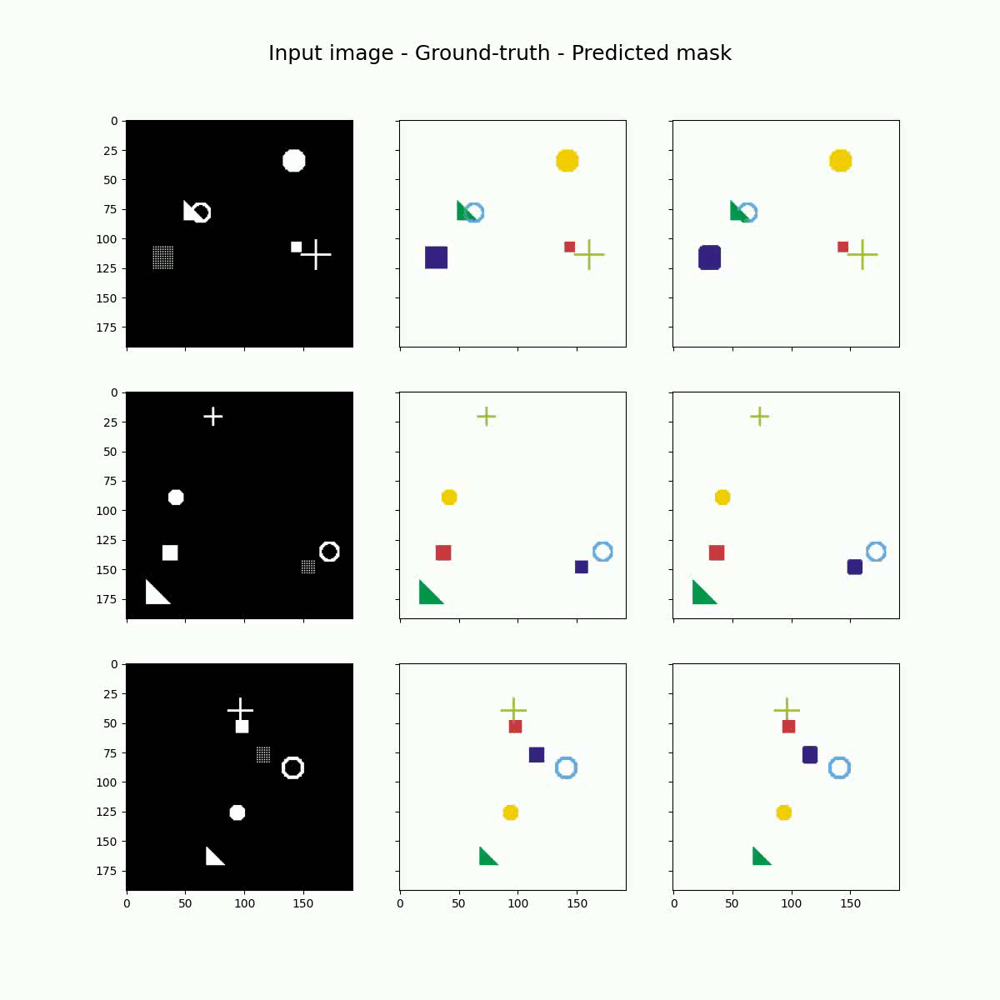

# Tutorial 3 - Synthetic Image Segmentation


## Usage
在本機端開始訓練
```shell 
$ cd python

# 開始訓練
$ python main.py
```

使用Tensorboard來觀看Loss
```shell
$ tensorboard --logdir=./checkpoints/tensorboard/
```


產生的資料夾內容
```shell
python/
    checkpoints/
        model/
            model.pth
        tensorboard/
    video/
        output.mp4
    output/
        result_0.png
        ...
```

## Help
```shell
$ python main.py --help
usage: main.py [-h] [--seed SEED] [--epoch EPOCH] [--num_worker NUM_WORKER] [--train_num TRAIN_NUM] [--val_num VAL_NUM] [--test_num TEST_NUM] [--train_batchsize TRAIN_BATCHSIZE]
               [--val_batchsize VAL_BATCHSIZE] [--test_batchsize TEST_BATCHSIZE] [--optimizer OPTIMIZER] [--lr LR] [--weight_decay WEIGHT_DECAY] [--save_model_path SAVE_MODEL_PATH]
               [--video_name VIDEO_NAME] [--tensorboard TENSORBOARD] [--output OUTPUT] [--video_dir VIDEO_DIR]

Robotlab MLDL Training Tutorial 3 - Synthetic Image Segmentation

optional arguments:
  -h, --help            show this help message and exit
  --seed SEED           Set random seed
  --epoch EPOCH         Set training epochs
  --num_worker NUM_WORKER
                        Set number of worker
  --train_num TRAIN_NUM
                        Set number of training data
  --val_num VAL_NUM     Set number of validation data
  --test_num TEST_NUM   Set number of test data
  --train_batchsize TRAIN_BATCHSIZE
                        Set training batchsize
  --val_batchsize VAL_BATCHSIZE
                        Set validation batchsize
  --test_batchsize TEST_BATCHSIZE
                        Set test batchsize
  --optimizer OPTIMIZER
                        Set optimizer
  --lr LR               Set learning rate
  --weight_decay WEIGHT_DECAY
                        Set weight decay
  --save_model_path SAVE_MODEL_PATH
                        Path of saved model
  --video_name VIDEO_NAME
                        Name of output video
  --tensorboard TENSORBOARD
                        Path of tensorboard
  --output OUTPUT       Path of output result
  --video_dir VIDEO_DIR
                        Path of test images vidoe directory
```