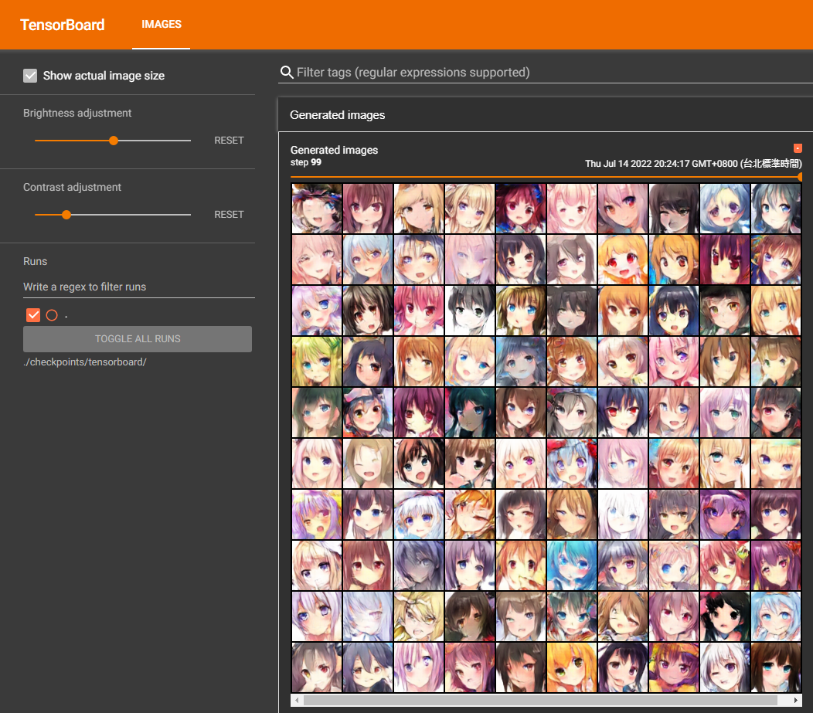

# Tutorial 4 - Anime Face Generation


## Usage
在本機端開始訓練
```shell 
$ cd python

# 下載訓練資料
$ python download_dataset.py

# 開始訓練
$ python main.py
```

使用Tensorboard來觀看產生的動漫人臉
```shell
$ tensorboard --logdir=./checkpoints/tensorboard/
```


產生的資料夾內容
```shell
python/
    checkpoints/
        images/
            Epoch_001.jpg
            ...
        model/
            G.pth
            D.pth
        tensorboard/
        video/
            output.mp4
    data/
        0.jpg
        ...
```

## Help
```shell
$ python main.py --help
usage: main.py [-h] [--seed SEED] [--epoch EPOCH] [--n_critic N_CRITIC] [--z_dim Z_DIM] [--train_batchsize TRAIN_BATCHSIZE] [--optimizer OPTIMIZER] [--lr LR] [--weight_decay WEIGHT_DECAY]
               [--train_path TRAIN_PATH] [--outdir OUTDIR] [--outvideo OUTVIDEO] [--video_name VIDEO_NAME] [--save_g_model_path SAVE_G_MODEL_PATH] [--save_d_model_path SAVE_D_MODEL_PATH]
               [--tensorboard TENSORBOARD]

Robotlab MLDL Training Tutorial 4 - Anime Face Generation

optional arguments:
  -h, --help            show this help message and exit
  --seed SEED           Set random seed
  --epoch EPOCH         Set training epochs
  --n_critic N_CRITIC   Set number of critics
  --z_dim Z_DIM         Set the dimension of z space
  --train_batchsize TRAIN_BATCHSIZE
                        Set training batchsize
  --optimizer OPTIMIZER
                        Set optimizer
  --lr LR               Set learning rate
  --weight_decay WEIGHT_DECAY
                        Set weight decay
  --train_path TRAIN_PATH
                        Path of training data
  --outdir OUTDIR       Path of generated images
  --outvideo OUTVIDEO   Path of vidoe of generated images
  --video_name VIDEO_NAME
                        Name of output video
  --save_g_model_path SAVE_G_MODEL_PATH
                        Path of generator model
  --save_d_model_path SAVE_D_MODEL_PATH
                        Path of discriminator model
  --tensorboard TENSORBOARD
                        Path of tensorboard
```