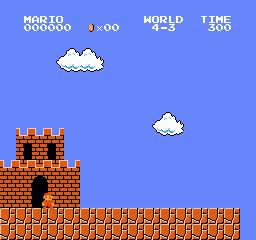

# Tutorial 5 - Super Mario
|World/Stage|1|2|3|4|
|-|-|-|-|-|
|1|||||
|2|||||
|3|||||
|4|||||
|5|||||
|6|||||
|7|||||
|8|||||

## Usage
在本機端開始訓練
```shell
$ cd python

# 開始訓練(預設是World 1-1)
$ python main.py

# 針對特定World或者Stage進行訓練
$ python main.py --world {index of world (1~8)} --stage {index of stage (1~4)}

# 訓練完成後可以看表現如何(預設是World 1-1)
$ python eval.py

# 針對特定World或者Stage看表現如何
$ python eval.py --world {index of world (1~8)} --stage {index of stage (1~4)}
```

使用Tensorboard來觀看模型的Reward，以及PPO模型的其他參數變化
```shell
$ tensorboard --logdir=./checkpoints/tensorboard/
```


產生的資料夾內容
```shell
python/
    checkpoints/
        model/
            mario_world_{index of world}_{index of stage}.pth
        tensorboard/
            PPO_1/
            Reward_average reward/
            Reward_best reward/
    video/
        video_world_{index of world}_{index of stage}.mp4
```

## Help
```shell
$ python main.py --help
usage: main.py [-h] [--seed SEED] [--world WORLD] [--stage STAGE] [--version VERSION] [--action_type ACTION_TYPE] [--num_skip_frame NUM_SKIP_FRAME] [--downsample_rate DOWNSAMPLE_RATE]
               [--num_stack_frame NUM_STACK_FRAME] [--total_timestep TOTAL_TIMESTEP] [--max_step MAX_STEP] [--step STEP] [--episode EPISODE] [--lr LR] [--epoch EPOCH] [--batchsize BATCHSIZE]
               [--gamma GAMMA] [--check_freq CHECK_FREQ] [--save_model_dir SAVE_MODEL_DIR] [--tensorboard TENSORBOARD] [--output_video OUTPUT_VIDEO]

Robotlab MLDL Training Tutorial 5 - Super Mario

optional arguments:
  -h, --help            show this help message and exit
  --seed SEED           Set random seed
  --world WORLD         Set a number in {1, 2, 3, 4, 5, 6, 7, 8} indicating the world
  --stage STAGE         Set a number in {1, 2, 3, 4} indicating the stage within a world
  --version VERSION     Set a number in {0, 1, 2, 3} specifying the ROM mode to use
  --action_type ACTION_TYPE
                        Set mario action type in {right, simple, complex}
  --num_skip_frame NUM_SKIP_FRAME
                        Set number of environment skip frame
  --downsample_rate DOWNSAMPLE_RATE
                        Set rate of environment downsample
  --num_stack_frame NUM_STACK_FRAME
                        Set number of environment stack frame
  --total_timestep TOTAL_TIMESTEP
                        Set total training timestep
  --max_step MAX_STEP   Set maximum of step
  --step STEP           Set number of steps to run for each environment
  --episode EPISODE     Set number of episode
  --lr LR               Set learning rate
  --epoch EPOCH         Set training epochs
  --batchsize BATCHSIZE
                        Set training batchsize
  --gamma GAMMA         Set discount factor for rewards
  --check_freq CHECK_FREQ
                        Set frequency to save model weight
  --save_model_dir SAVE_MODEL_DIR
                        Path of saved model directory
  --tensorboard TENSORBOARD
                        Path of tensorboard
  --output_video OUTPUT_VIDEO
                        Path of output vidoe directory
```
